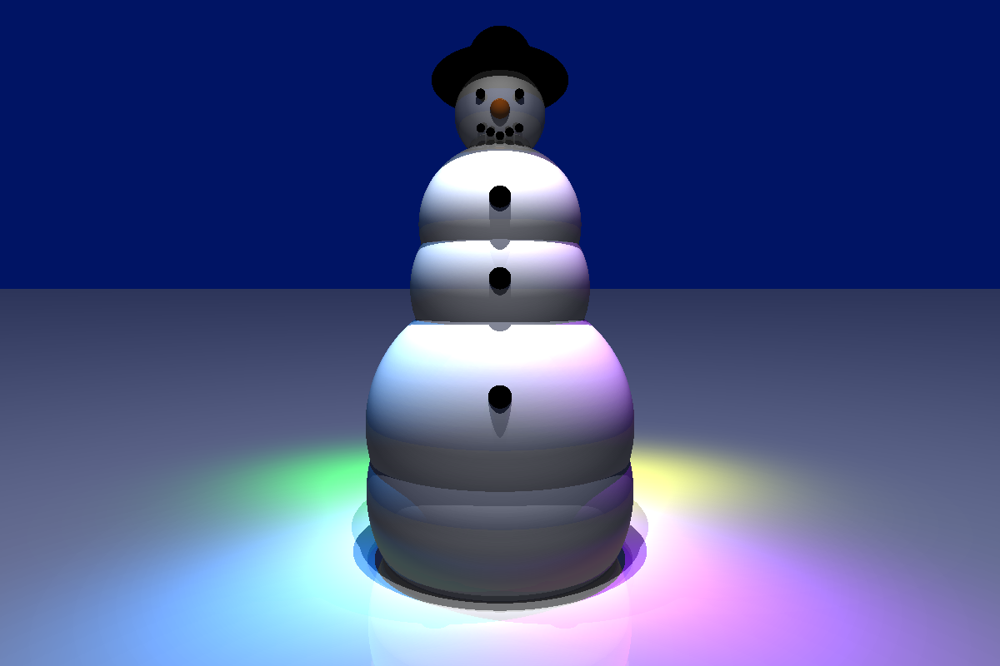

# Raytracer #
<sup>2013</sup>



A graphics raytracer, some features:

* Moveable camera and generation of BMP images.
* Primitives: planes, spheres and triangles (though there is a bug with the
    material shading at the moment).
* Shadows.
* Reflections (recursive reflections).
* Lighting: ambient light, point lights and spot lights.
* Materials: lambertian and specular materials.
* Accelerated rendering by storing objects in a bounding volume hierarchy.

Some things that would be fun to add:

* Transparent materials.
* Texture maps.

### Dependencies ###

* Gtest.
* GCC.

### Compiling ###

Compile the raytracer with:

```
make all
```
